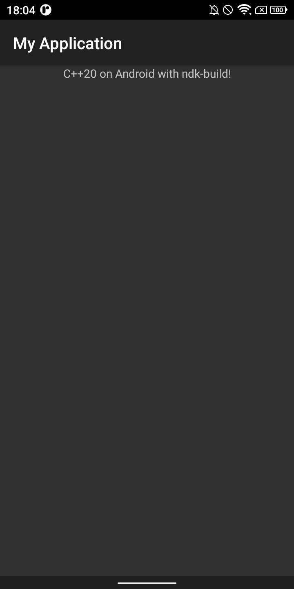

# hello-jni-ndkbuild-cpp20

Up-to-date [hello-jni](https://github.com/android/ndk-samples) example that uses [ndk-build](https://developer.android.com/ndk/guides/android_mk) instead of cmake.

Made as preparation to ditch cmake entirely for building [my mobile games](https://doomhowl-interactive.com).<br/>
*Modern C++ on Android with simple makefiles!*

## Implementation

```c++
#include "jni.h"
#include "android_native_app_glue.h"

#include <string>
#include <format>

extern "C" jstring Java_com_example_myapplication_NativeView_stringFromJNI(JNIEnv *env)
{
    std::string msg = std::format("C++20 on {} with {}!", "Android", "ndk-build");
    return env->NewStringUTF(msg.c_str());
}
```
